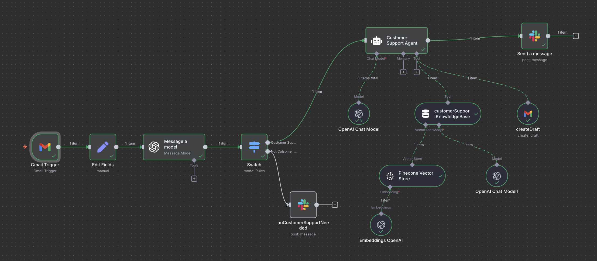
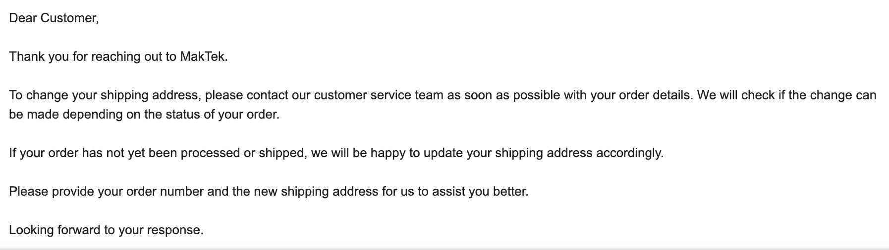

# Customer Support AI Agent (n8n + OpenAI + Pinecone + Gmail + Slack)

This project automates customer-support replies from a Gmail inbox using an AI agent orchestrated in **n8n**.  
The agent classifies incoming messages, retrieves policy/FAQ context from **Pinecone** (RAG), drafts a reply **in the original email thread**, and posts a status summary to **Slack** for oversight.

> Built for reliability, transparency, and speed. Designed so non-technical teams can operate with enterprise-style guardrails.

---

## Why this matters (business value)

- **Faster replies** with policy-aligned language  
- **Consistent tone** across agents and shifts  
- **Human-in-the-loop** review via Slack, so quality stays high  
- **Extensible**: swap Gmail/Slack for Outlook/Teams; add Jira or CRM in minutes

---

## What’s inside (high level)

- **n8n workflow** orchestrating the pipeline  
- **LLM classifier** to decide “Customer Support” vs “Not Support”  
- **RAG** (retrieval-augmented generation) using Pinecone to ground responses in your policies/FAQs  
- **Gmail draft** created in-thread for one-click send  
- **Slack notification** with a concise summary for team awareness

> Note: The exact node connections/expressions are intentionally summarized here. The full recipe can be shared privately for interviews or collaboration.

---

## How it’s built (confidential summary)

- **Trigger:** Gmail fires when a message arrives (optional: pass full raw text for better context).
- **Understand:** An LLM evaluates if the email is a support request.
- **Retrieve:** For support emails, a vector-search tool queries a Pinecone namespace (e.g., `customer_support`) to pull policy snippets.
- **Draft:** The agent composes a reply (subject + body) and saves it as a **Gmail draft in the same thread**.
- **Notify:** Slack receives a short summary so a human can review and send.

This pattern follows a modular, agent-based RAG design that’s easy to extend (additional tools, channels, or constraints).

Detailed build notes and the workflow export are available privately for interview or collaboration.
For a private walkthrough or the exact node configuration/export, contact me.

---

## Setup (what you need and why)

**Accounts/Credentials (names only; do not share values):**
- `OPENAI_API_KEY` — lets the model classify emails and generate drafts.
- `PINECONE_API_KEY`, `PINECONE_ENVIRONMENT`, `PINECONE_INDEX`, `PINECONE_NAMESPACE` — store and retrieve policy chunks for accurate answers.
- `SLACK_BOT_TOKEN` — send a short summary to Slack for human review.
- `GMAIL_CLIENT_ID`, `GMAIL_CLIENT_SECRET`, `GMAIL_REDIRECT_URI` — OAuth access to create drafts in your Gmail inbox.

> **Where to put them:** In n8n, add these in **Credentials** (recommended).  
> If self-hosting with Docker, keep a **private** `.env` (never commit secrets; use a `.env.example` for placeholders).

**Minimal configuration checklist**
- [ ] In n8n, connect **OpenAI** (chat + embeddings)  
- [ ] Connect **Pinecone**; set `INDEX=customer_support` and `NAMESPACE=customer_support` (or your names)  
- [ ] Connect **Gmail** (OAuth) and **Slack**  
- [ ] Load your policy/FAQ docs into Pinecone (chunk → embed → upsert)  
- [ ] Test with a pinned sample email; then activate the workflow

---

## Screenshots


<p align="center">
  
</p>
<p align="center">
  
</p>


---

## Repo structure

```
customer-support-n8n-agent/
├─ assets/
│  ├─ workflow.png
│  ├─ draft_email.png
│  └─ loader_pipeline.png
├─ README.md
├─ .gitignore
├─ LICENSE
├─ .env.example
├─ export/                # (optional) n8n-workflow.json for private sharing
└─ kb/                    # (optional) example policy docs (text)
```


## Notes & troubleshooting

- If drafts aren’t created in the same thread, verify the **threadId** field mapping in n8n.  
- If responses look generic, confirm the **Pinecone namespace** and **embedding model** match in both load and query.  
- Slack rate limits: add retries or a small buffer node.  
- Outlook/Teams? Swap connectors and keep the same RAG + draft + notify pattern.

---

## License

MIT — use freely. For full workflow details, contact the author for a private walkthrough.
